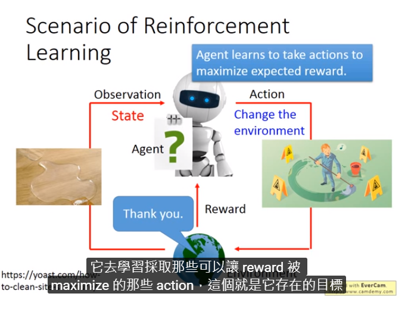
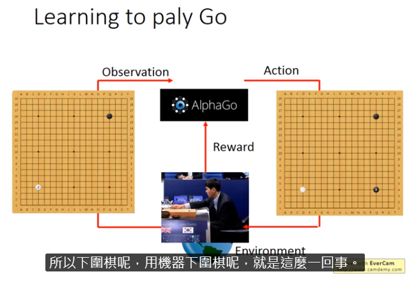
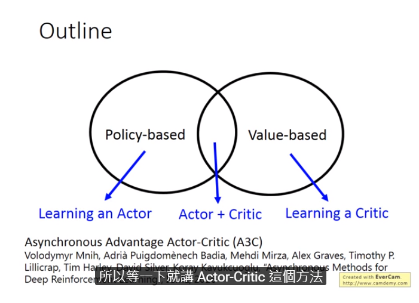
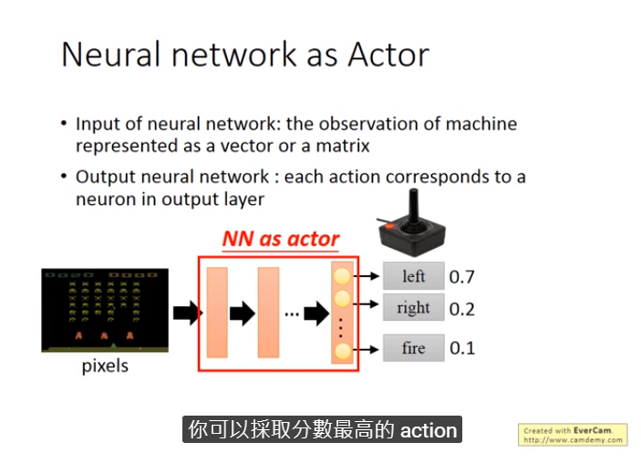
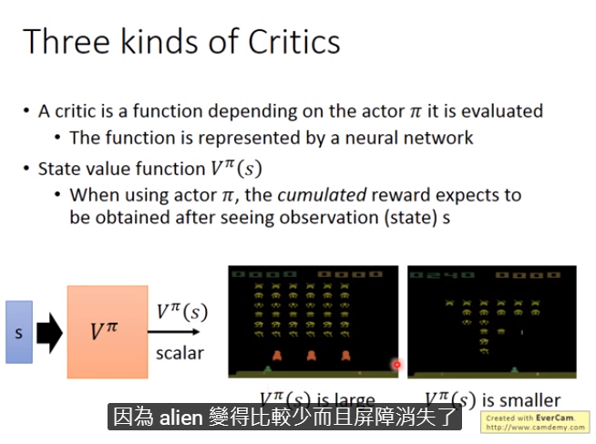

## 强化学习

agent（observation）观察环境的状态+environment
agent（action）做出动作+对环境产生影响。

比如AlphaGO，observation就是棋盘，take的action就是落子的动作。

## 强化学习和监督学习
- 监督学习
看到一个环境状态，你也不知道最正确的结果是什么，没办法对应标签。
什么输入，就有什么输出，有一一对应，有比较标准的正确答案。
==有老师来解释==。
- 强化学习
没有标准的正确答案，或者说标签。
让机器不管他，让它找一个人和它下棋，赢了就得到positive reward，输了就得到negative reward。赢了就知道某些下法是好的，但是没有人告诉他，在这几百步里，哪部是好的，那几步是不好的。它要自己想法去知道，是从过去的经验学习，没有老师告诉什么是好的，什么是不好的，需要自己知道。需要训练大量的次数。
==只知道结果，从评价里学习。这就像人类在社会中的学习一样。==
## 强化学习应用
- 玩游戏：让机器玩游戏，看到就是屏幕画面，就是pixe，matrix，然后take那个action。

## 强化学习难点
- reward dalay
reward出现会有delay的延迟。只有开火才会得到reward，就是有远见，牺牲现在一些小的利益，以获取最后的成功。
- 探索
所采取的行为，影响后面的结果。要学会探索，尝试新的action。
## 分类
强化学习主要有两个方法类型。
- policy-based方法
- Value-based方法

#### plolicy-based
Machine Learing==Looking for a Function

policy-based也是一个找function的过程。

Neural network as Actor就是policy-based类型。

output就是：左移，右移，开火。
输入：就是一个image

使用neural network好处
- 神经网络可以举一反三的，neural network，比较generalize。
- 游戏本身是有随机性，不maximize一次的结果，而是几百次的结果。

#### value-based

学习一个function
