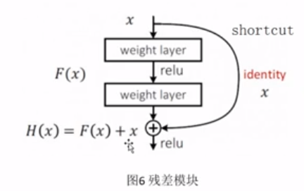
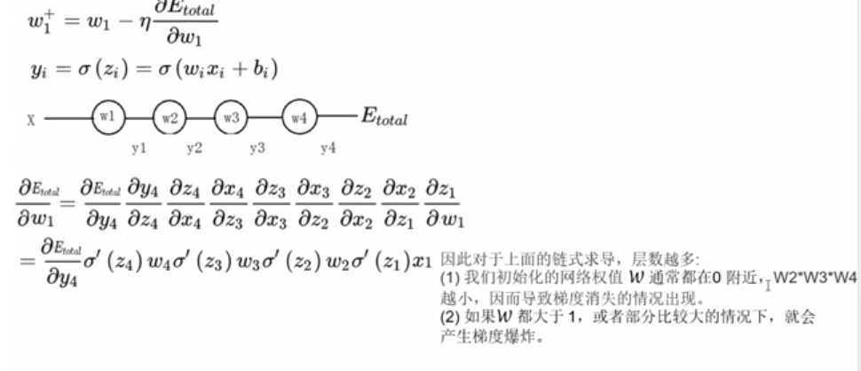

在深度学习中，网络层数增多一般会伴着下面几个问题：
- 计算资源的消耗
- 模型容易过拟合
- 梯度消失/梯度爆炸问题的产生

问题1可以通过GPU集群来解决，对于一个企业资源并不是很大的问题；问题2的过拟合通过采集海量数据，并配合Dropout正则化等方法也可以有效避免；问题3通过Batch Normalization也可以避免。貌似我们只要无脑的增加网络的层数，我们就能从此获益，但实验数据给了我们当头一棒。作者发现，随着网络层数的增加，网络发生了退化
（degradation）的现象：随着网络层数的增多，训练集loss逐渐下降，然后趋于饱和，当你再增加网络深度的话，训练集loss反而会增大。注意这并不是过拟合，因为在过拟合中训练loss是一直减小的。
## 残差网络
特点：有很深的深度。

深网络：特征的等级越高，有比较强的表达能力。

梯度弥散问题和退化问题

对于新增加的层F(x)，可以跳过新增加的层数，然后求和再继续向下传播。
## 为什么会有梯度弥散（爆炸）
链式法则更新求导

激活函数求导都有最大值和最小值，relu为1，sigmoid为0.25。
整个公式的重点都在Wi上
- 假设开始很小，那么相乘之后，就越来越小，导致最后就不更新了。
- 假设开始很大，相乘之后，就会越来越大，导致梯度就会差生爆炸。

#### 残差网络解决梯度弥散
因为shortcut的加入使得gradient通过“1”流回到任意浅层，避免了经过weight layer造成的梯度弥散。

Resnet可以理解为传话游戏，有时候传的的人越多，错误越高率，Shortcut就相当于直接把第一个人说的话就告诉第三个人。减少错误率。

## 为什么叫做残差网络
统计学中，残差和误差是非常容易混淆的两个概念。
- 误差是衡量观测值和真实值之间的差距
- 残差是指预测值和观测值之间的差距

多层感知器：使用全连接层（fully connected layer），值接受向量作为输入
CNN：局部连接层，可接受矩阵作为输入。
## 残差网络的特征
- 网络较瘦
- 存在明显层级
- 使用了较少的池化层，大量使用下采样，提高传播效率。
- 没有使用Dropout，利用BN和全局平均池化进行正则化，加快了训练速度。
- 层数较高时减少了3*3卷积个数，并用1*1卷积控制了3*3卷积的输入输出特征图数量，称这种结构为“瓶颈”
