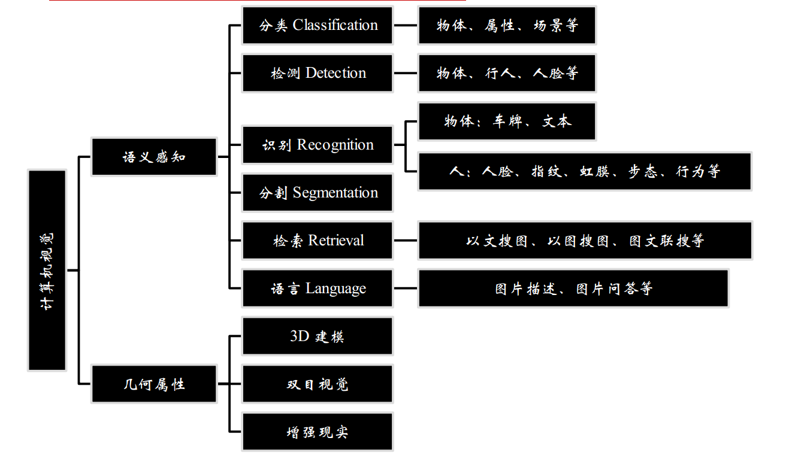

- 图像分类：卷积神经网络CNN
- 图像检测：区域卷积神经网络R-CNN
- 图像分割：全卷积神经网络FCN
- 图像描述：迭代神经网络RNN
- 图像问答：迭代神经网络RNN
- 图像生成：生成对抗网络GAN

计算机视觉的应用场景

主要目的：解决像素值与语义值之间的差距
- 语义感知
    - 分类：物体，属性，场景。
    - 检测：物体，行人，人脸。
    - 识别：物体：车牌，文本；人：人脸，指纹，虹膜等
    - 分割
    - 检索：以文搜图，以图搜图；
    - 余元：图片描述，图片问答等。
- 几何属性
    - 3D建模
    - 双目视觉
    - 增强现实

## 图像分类
判断图片有没有物体
## 图像检测
检测：目标在哪儿？检测具体位置。
- 物体检测
- 人脸检测
- 行人检测
## 识别
内容是什么？
- 人脸识别
- 字符识别
- 车牌识别
- 行为识别
- 步态识别
## 分割
图片分割-》区域轮廓？
- 前景分割：二类分割
- 语义分割：多类分割
## 视觉&语言
图片描述
图片问答
## 图片检测
搜索相似的图片
## 计算机视觉的重要工作
- 特征工程---》特征设计：之前的主要工作
- DNN结构工程--》网络设计：现在研究的主要内容。
