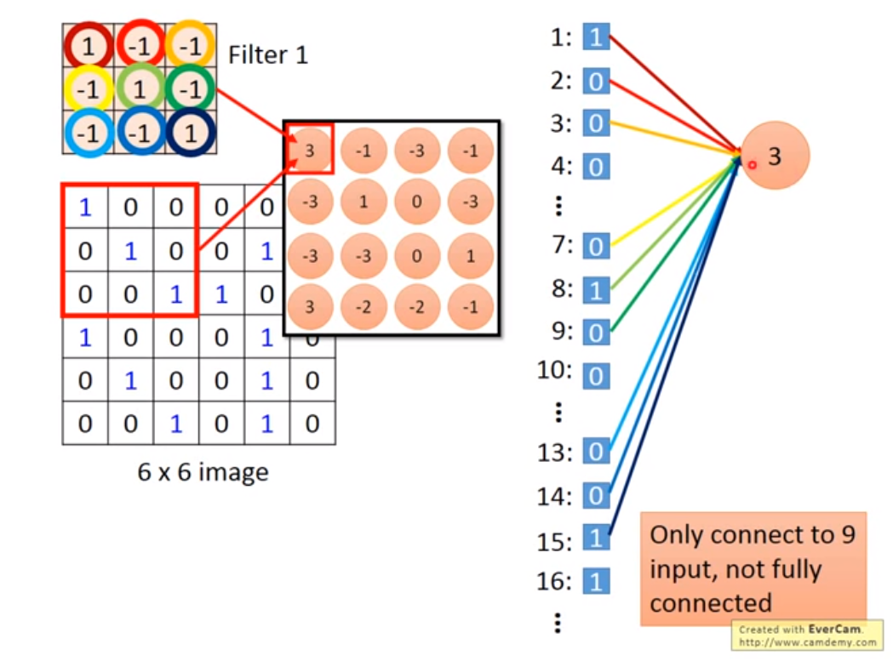
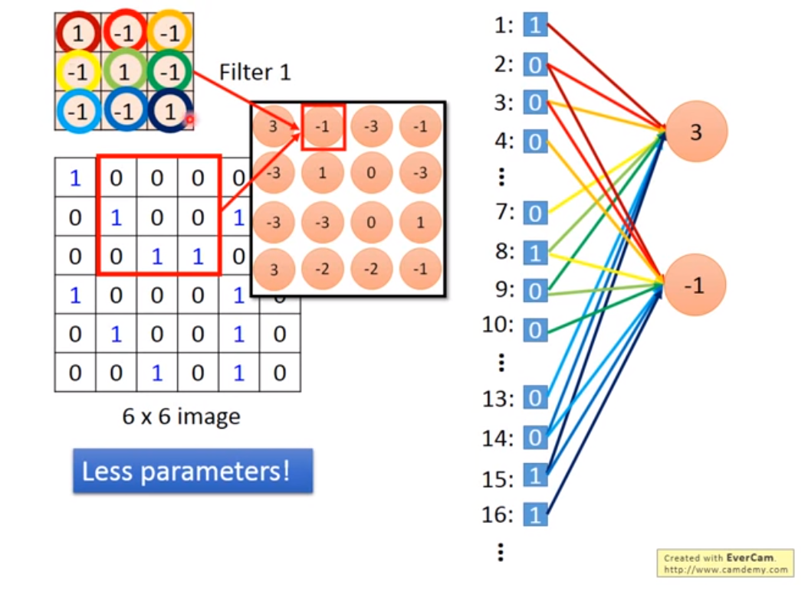

一个对应图像深度的一个卷积核滤波器大小为H*W*D，按照滑动步长来对图像进行卷积计算，最后得到一层大小为M*N的特征图。

==最底层的一般是提取线条的特征，各个方向，长度，宽度等等，人类和CNN理解的世界是不一样的。==
- 图片中pattern一般是图片中比较小的，不需要看整张图片。
- 第一层的layer就是侦测某一种pattern，比如一个neural，他要看某个pattern有没有出现，它不要看整张图片，而是看一小部分。
- 比如检测鸟的话，一个neur侦测鸟嘴，另一个侦测鸟翅膀等等。
- 每一个neural只需要连接到一小块区域就好，不需要连接到整张的图片。
- 同一个pattern可能出现在图片中的不同区域，但是代表同样的含义，所以可以共用参数，所以就采用滑动的操作。
## 别称-（局部感受野）
- 表示一个局部的空间信息
- 共享权重和偏置
## 卷积与全连接层的区别
全连接层和卷积层中的神经元都是计算点积和非线性激活，函数形式是一样的，唯一的差别在于卷积层中的神经元只与输入数据中的一个局部区域连接，并且采用参数共享； 而全连接层中的神经元与输入数据中的全部区域都连接，并且参数各不相同。
- 全连接层转化为卷积层
卷积核的大小尺寸设置为和输入特征图的空间尺寸一致，不需要0填充，也不需要滑动卷积窗口。
- 卷积层转换为全连接层
任意一个卷积层都能转换为等价的全连接层。此时连接整个输入空间的权重矩阵是一个巨大的矩阵，除了特定区域外，其余全是0.
## 卷积核
每一个卷积核都可以看做是一个特征的检测器，只有对应的特征图片在这个卷积核上的响应是最大的。

对于一个N*N图像，特征的大小是K*k，每一个卷积核（特征）和图像卷积得到一个((N-ksize+2*padding)/stride+1)\*((N-ksize+2*padding)/stride+1)大小的卷积特征。

如果要验证M个特征，一幅图像就得生成一个(N-k+1)\*(N-k+1)\*N*M维的一个长向量,就是一个特征向量。
#### 1*1卷积
作用是通融合，即如果当前层为m层，然后对当前的m层做线性变换，使其最后输出n个值，即变为n层，降维的作用（需要考虑1×1卷积核本身的参数个数为m×n个）。
这个操作实现的就是多个feature map的线性组合，可以实现feature map在通道个数上的变化。

在channels上做全连接的工作。
## 卷积层
可以通过K个卷积核滤波器来进行特征提取，最后得到M*N*K的一个特征集，深度为卷积核的数量，这个就叫做卷积层。

多个滤波器的叠加便成了卷积层。
## CNN VS FC

- weights减少
- weights共享
