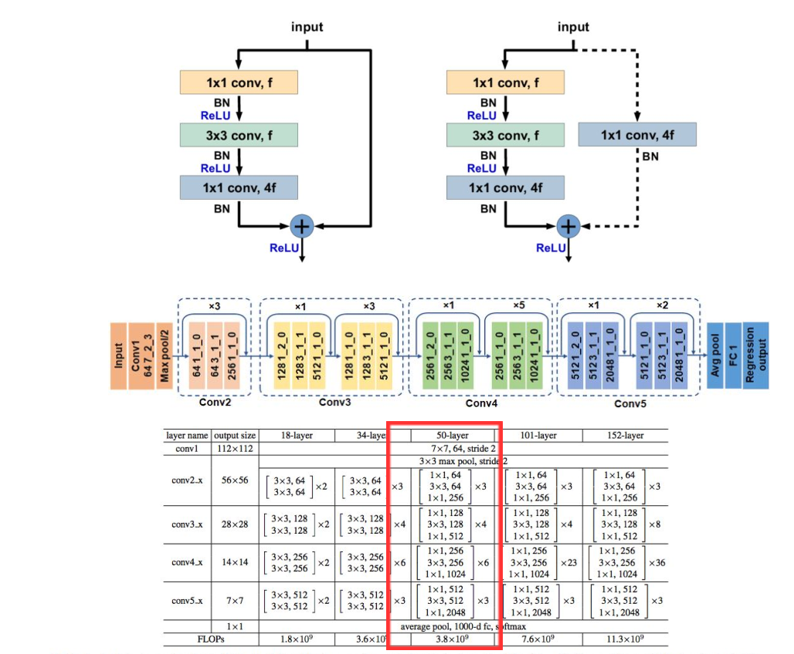

15年，微软研究院的研究员在设计了更深的resnet网络152层。
误差反向传播过程，梯度变得越来越小，从而权重的更新量也变小。变宽不如更深的效果好。
## 网络结构

#### 先先定义一个基本的单元unit：
- 卷积
- Batch_Normalizetion
- ReLU

#### 在基本单元基础上定义一个子结构cons1：
- x1 = unit(in)
- x1 = uint(x1)
- x1 = Conv2d(x1)
- x1 = BN(x1)

- x2 = Conv2d(in)
- x2 = BN(x2)

- out = x1+x2
- output= relu（out）
#### 在基本单元基础上定义一个子结构res1:
- x1 = unit(in)
- x1 = uint(x1)
- x1 = Conv2d(x1)
- x1 = BN(x1)

output = x1+in
output= relu（output）
#### 总结构
- cons1
- for i in range(n): res1
- 全局平均池化操作
- Dense全连接层操作
## 示例代码
```py
def conv_bn_rl(x, f, k=1, s=1, p='same'):
    x = Conv2D(f, k, strides=s, padding=p)(x)
    x = BatchNormalization()(x)
    x = ReLU()(x)
    return x


def identity_block(tensor, f):
    x = conv_bn_rl(tensor, f)
    x = conv_bn_rl(x, f, 3)
    x = Conv2D(4*f, 1)(x)
    x = BatchNormalization()(x)

    x = add([x, tensor])
    output = ReLU()(x)
    return output


def conv_block(tensor, f, s):
    x = conv_bn_rl(tensor, f)
    x = conv_bn_rl(x, f, 3, s)
    x = Conv2D(4*f, 1)(x)
    x = BatchNormalization()(x)

    shortcut = Conv2D(4*f, 1, strides=s)(tensor)
    shortcut = BatchNormalization()(shortcut)

    x = add([x, shortcut])
    output = ReLU()(x)
    return output


def resnet_block(x, f, r, s=2):
    x = conv_block(x, f, s)
    for _ in range(r-1):
      x = identity_block(x, f)
    return x


input = Input(input_shape)

x = conv_bn_rl(input, 64, 7, 2)
x = MaxPool2D(3, strides=2, padding='same')(x)

x = resnet_block(x, 64, 3, 1)
x = resnet_block(x, 128, 4)
x = resnet_block(x, 256, 6)
x = resnet_block(x, 512, 3)

x = GlobalAvgPool2D()(x)

output = Dense(n_classes, activation='softmax')(x)

model = Model(input, output)
```
