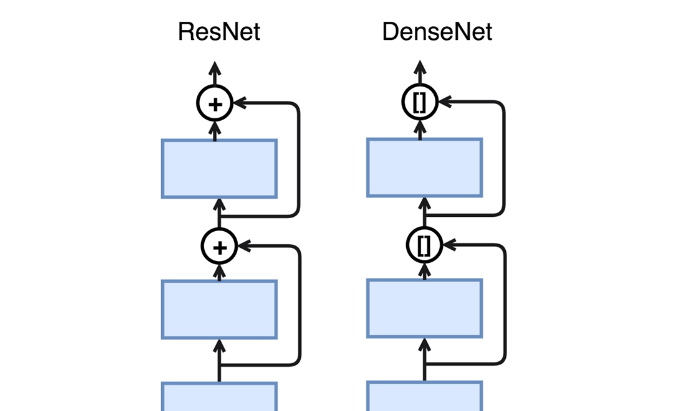

## DenseNet稠密连接的卷积神经网络

下面的每一层都会和上面相连，之前是做加法，这里做concat连接。
==加法变为拼接操作。==
- concat会变化层数即channels的数目。
## 过渡块
因为使用拼接的操作，每经过一次过渡块输出通道数可能会激增。为了控制模型的复杂度，这里引入了一个过渡块，它不仅把输入的长宽减半，同时也使用1*1卷积来改变通道数。
##Dense的主体
交替串联稠密块，他使用全局的groth_rate使得配置更加简单。过渡层每次将通道数减半。

==简单的网络连接使得patch比较简单。==
