反向传播依赖于正向传播，而且如果有多个分支流，那最后就是相加即可。
## 梯度下降
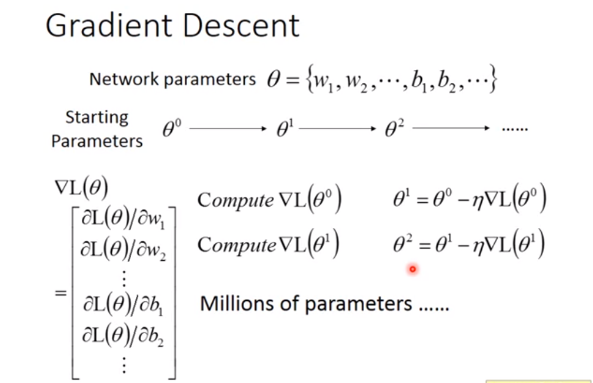
参数theta：${W1,W2,W3,W4,.....，B1,B2,B3,B4,...}$
选一个初始参数theta0，对loss的偏微分,然后更新theta1即可。
#### 链式法则
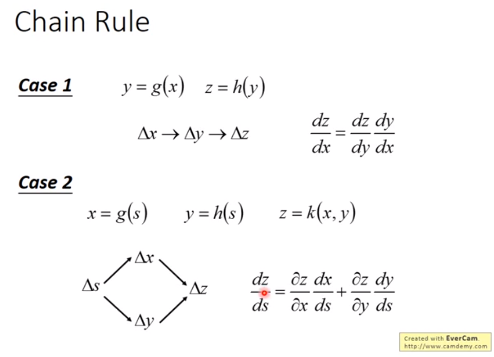
## Forward pass和Backward pass
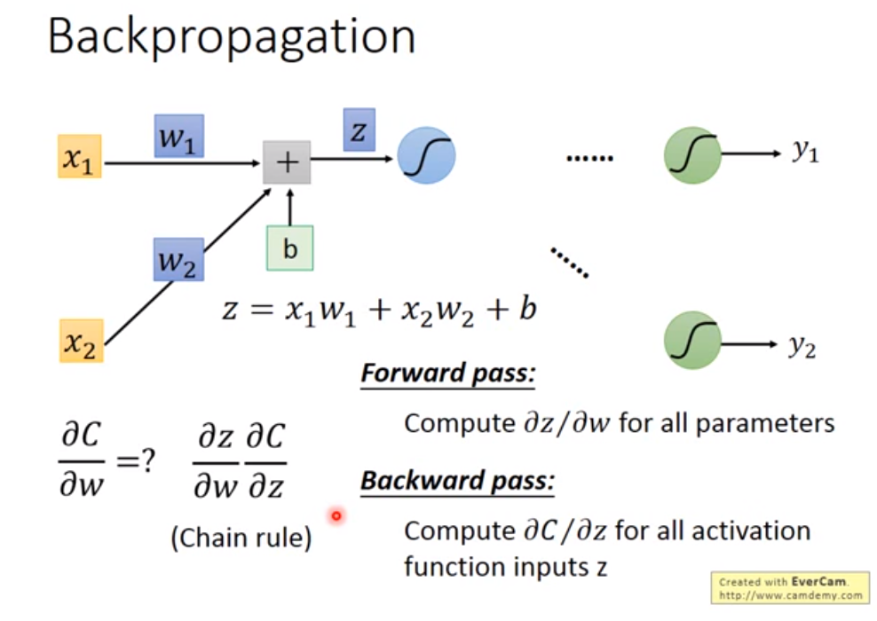
#### Forward pass
计算的结果就是上一层的输入，只看前面接的input：
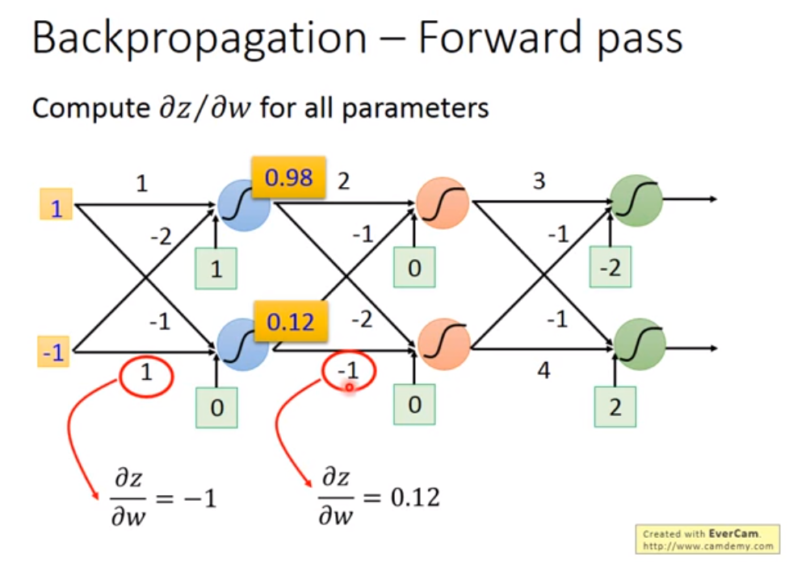
#### Backward pass
a = active(z)
计算loss对z的偏微分,等于a对z的偏微分乘以loss对a的偏微分。
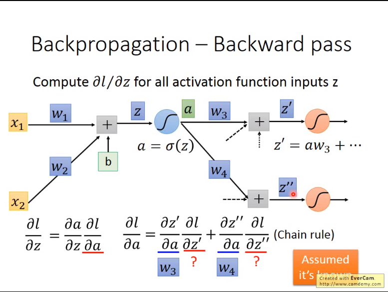
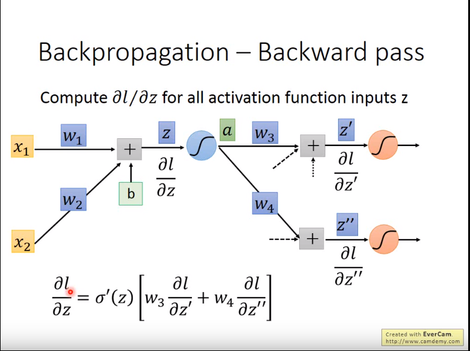
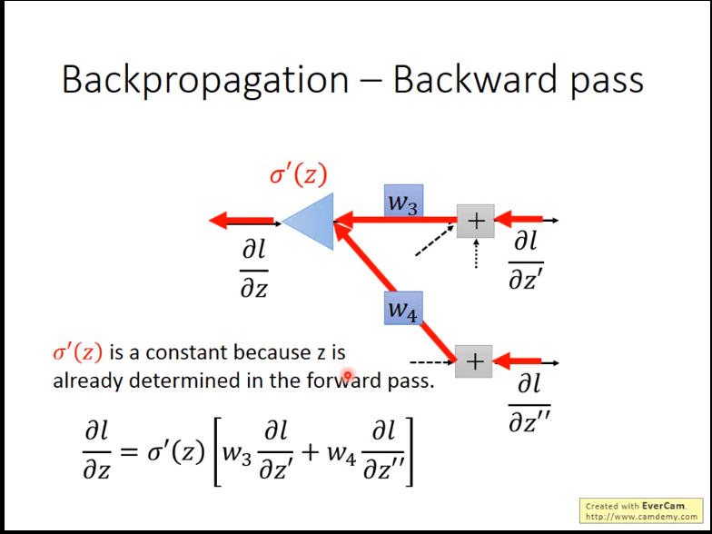
- 如果是最后一个layer：
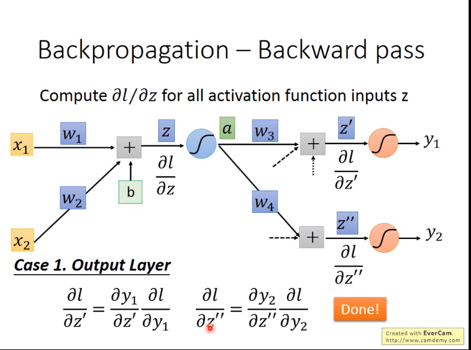
- 如果不是最后一个layer：
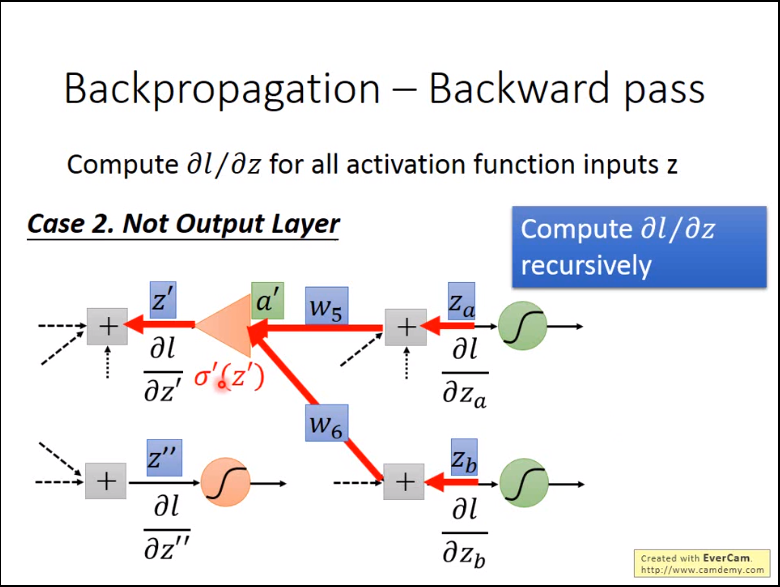

所以经过以上分析可以知道，计算权重从输出开始，就比较简单。
逆着方向，可以求出所有的loss对z的偏微分。
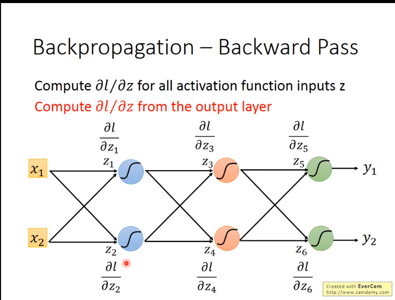
## 总结summary
计算loss对某一层W的偏微分，即链式法则，引出激活值z，然后求loss对z的偏微分和z对W的偏微分，将两者相乘即可。
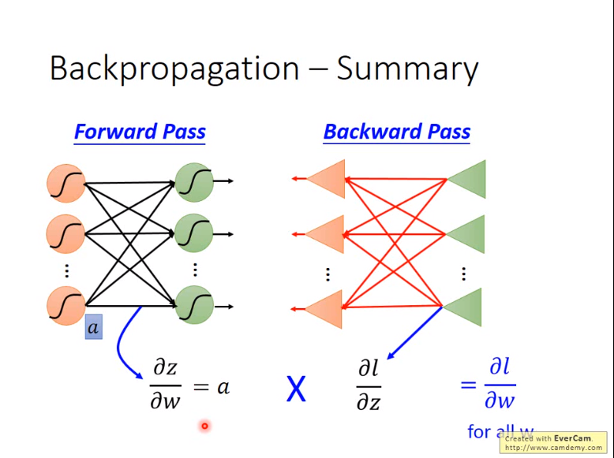
## 对于池化层的反向传播
mean_pool：将梯度平均
max_pool：返回一个最大的，其他的为零。
