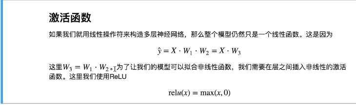

背景：
线形函数具有可加性和齐次性。
任意一个线形函数都可以等价为一个单线函数。
线形神经网络没法解决非线性问题。

==目的：引入非线性函数，对感兴趣的特征进行激活==

如果我们只用线形操作来构造神经网络，那么这个模型仍然只是一个线形函数。这是因为XW1W2 = XW3。为了让我们的模型可以拟合非线性函数，我们需要在层之间加入非线性的激活函数。
## 作用
通过深度学习可以知道，增加更多的深度也就是可以理解成增加更多的“折叠”，而足够多的折叠可以在理论上逼近任何一个函数，但是这样的拟合过程会造成数据的拟合过于平滑，甚至对不需要保存的数据值也一样予以保留和拟合。
而激活函数的作用就在数据类别之上进行分割，从而获得一个更好的拟合结果。
## 为什么要用非线性网络
- 第一个问题
那么将线形网络转换为非线性的，也就是把分割直线转换为曲线，是不是就能解决非线性分类问题。
我们从最简单的神经网络Y=W*X+B入手。
然后变成最简单的非线性网络Y= W*X*X+B。
变为曲线后我们好像可以对一些直线不能分类的问题进行分类。

- 第二个问题
根据input X的值，我们会得到Y值。所以我们需要一个函数可以对得到的Y值进行分类，比如Y大于0，分类为1；小于0，分类为0。
- 第三个问题
对于线形网络，我们是通过算出误差来更新权值，假设我们的x的值很大，或者无限大，那么Y就会很大，直接导致error太大，更新出来的权值没有意义。
- 第四个问题
涉及到反向传播，如果我们的神经函数是线形的，那么它的导数就是个常数，意味着梯度和x无关了，也就是和输入无关了，我们在做反向传播的时候，gridient也就变为常数了。
## 激活函数分类

> Written with [StackEdit](https://stackedit.io/).
<!--stackedit_data:
eyJoaXN0b3J5IjpbOTQyNjE0OTczLDEzOTAxMDIzODQsMTA4Mj
U4MTYxNywxNTMzOTQ4NTUzXX0=
-->
