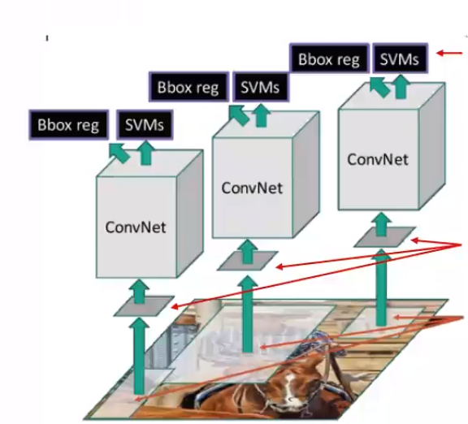
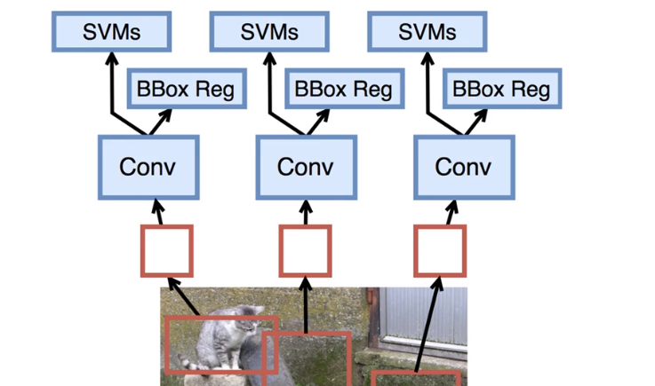

步骤
- 寻找selective search，随机搜索或者启发式搜索。
- 区域预处理，尺寸变换
- AlexNet网络
- 第七层输出4094维向量，线形SVM分类器，每个分类一个SVM。
- 第五层输出卷积层之后的Bounding box回归模型

## 过程

先使用features层来提取特征，基本上就是去掉最后一层全连接层即可，然后在训练两个loss，一个是分类的loss，一个是调节边框的loss，使得边框调节到合适的位置。
## 为什么用SVM，而不用softmax

## selective search
- 按一定的规则生成区域集R
- 计算区域集R里每个相邻的相似度S
- 找出相似度最高的两个区域，将其合并为新机，添加进R
    - 优先合并四种区域：颜色，纹理，合并为总面积最小的
- 从S中移除所有与2中有关的子集
- 计算新集与所有子集的相似度
- 跳至2
## 召回率和准确率
召回率高：大街上没有坏人
准确率高：抓到监狱里的全是坏人
