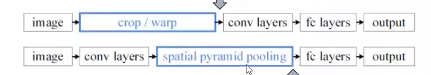
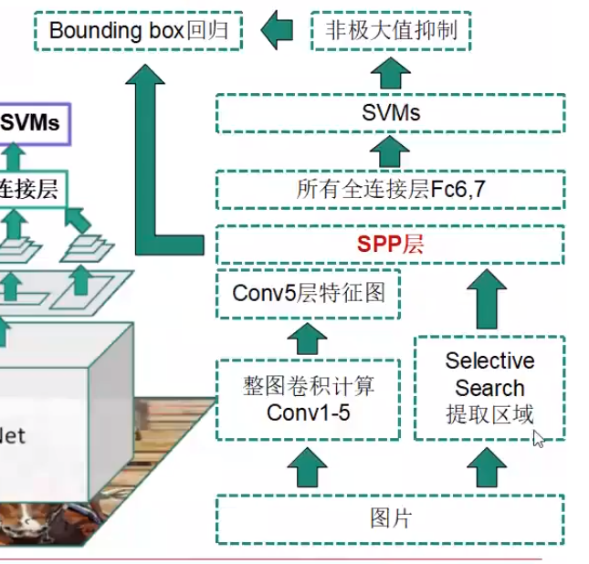
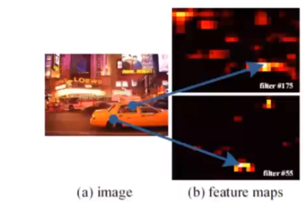
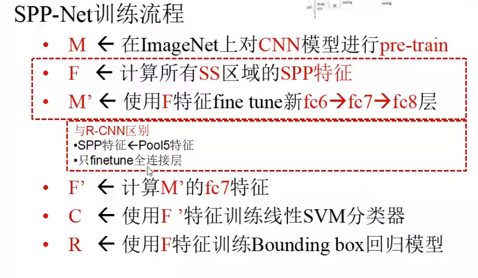

## R-CNN的不足
R-CNN速度慢的原因之一：
- 卷积特征重复计算量太大。
- 每张图片的2000个区域都会计算CNN特征
## SPP-NET
改进
- 直接输入整张图，所有区域共享卷积计算，在conv5层输出上提取所有区域的特征
- 引入空间金字塔池化
    - 为不同尺寸的区域，在conv5输出上提取特征
    - 映射到尺寸固定的全连接层上
   

#### 为什么可以先卷积再进行框的选择
- 对卷积层可视化发现：输入图片的某个位置的特征反应在特征图上也是在相同的位置
- 基于此，对某个ROI区域的特征提取只需要在特征图上的响应位置提取就可以了。
- 也就是说卷积层如果对某个感兴趣的区域激活，然后在特征图上就会比较亮，卷积的输出值就会比较大。而且如果是padding卷积的话，相对位置也是相同的，不会发生变化。

SPP-Net训练过程

