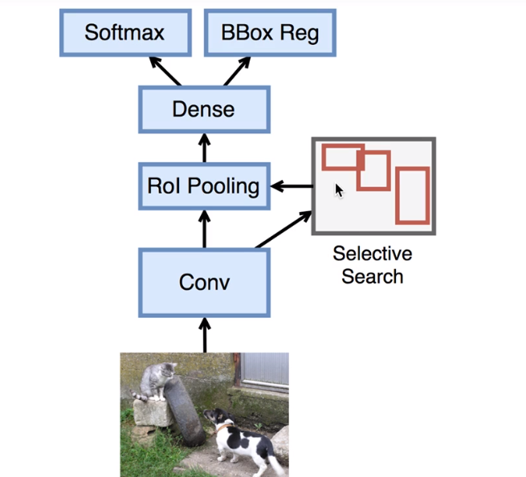
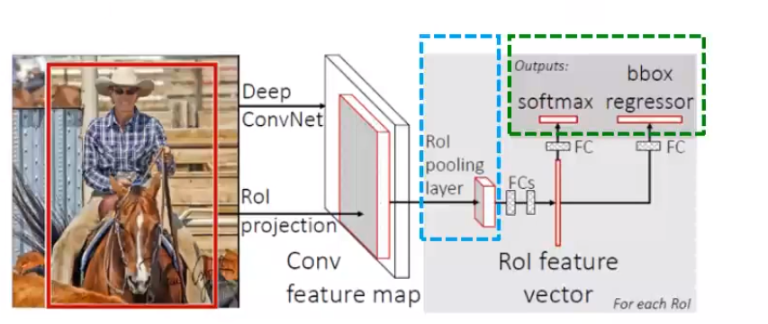
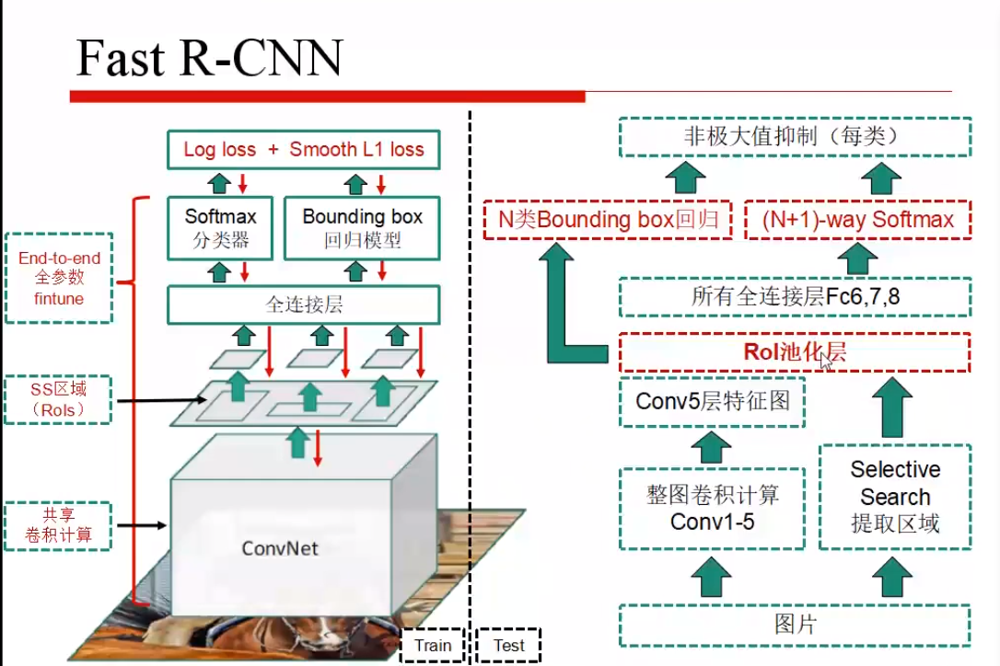
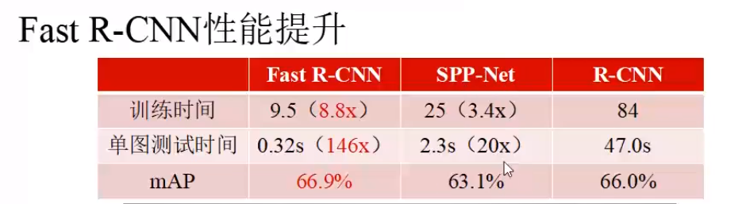

改进
- 比R-CNN，SPP-Net更快的training/test
- 更高的mAP
- 实现end-to-end（端到端）单阶段训练
    - 多任务损失函数
- 所有层的参数都可以fine tune
- 不需要离线存储特征文件
## 原理

所有的feature放在一起，分辨率会有影响。
怎么在卷积层将所的方框同一标准呢？
就有了RoI Pooling，对每一个region，均匀切，对小区域做max pooling ，找一个最大的值，然后就输出。
#### 引入2个新技术
- 感兴趣区域池化层（RoI pooling layer）
- 多任务损失函数（Multi-task loss）

fast R-CNN与SPP的区别

- SVD进行全连接分解
三者的对比

