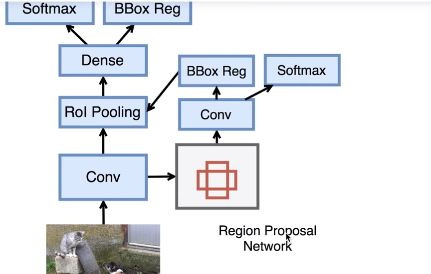

将启发式搜索变为RPN的一个网络,然后也对其进行训练。
## Faster-R-CNN
集成RPN网络- Region Proposal Network网络，区域建议网络，取代SS模块。

- Faster-RCNN = FastR-CNN+RPN
- 取代离线Selective Search模块
- 进一步共享卷积层计算
- 基于attention注意机制
- Region proposals量少质优：高precision，高recall
#### RPN网络
RPN的输出就是一个框，即框的边界位置：五位向量，类别+左上角坐标+右下角坐标。所以还是需要对前一层的Conv做ROI Pooling操作。
- 对于得到的卷积层，然后对于响应比较大的区域，首先默认选择一些框。
- 对框进行卷积，输出到下一层。
- 然后对框进行一次分类softmax，是不是有物体，如果有就把它送入ROI Pooling，如果不是就直接丢弃。
## Faster R-CNN网络
- step1：训练RPN网络
- step2：训练Fast R-CNN网络
==以上卷积层无法共享==
- step3：调优RPN
- step4：调优Fast R-CNN
==以上卷积层共享，用的是step2的卷积层参数。==
