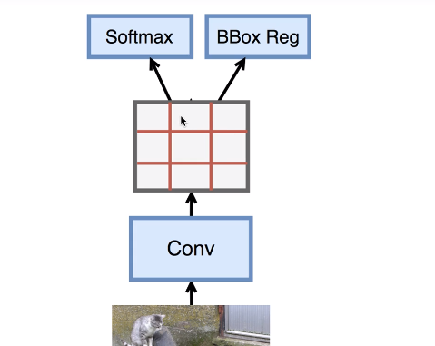
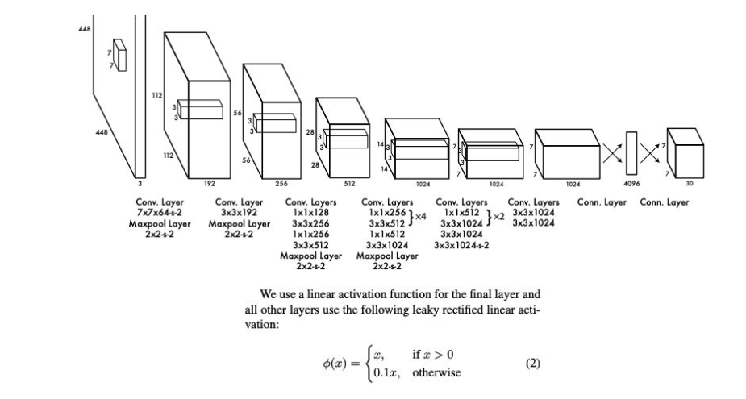
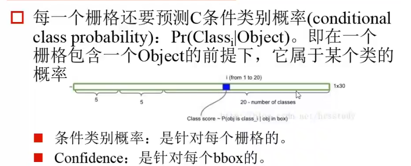

YOLO是2015年提出的，SSD生成大量的锚框。YOLO可以最多识别9000个类别。

## YOLO v1

- 先对图像进行resize：448*448，作为神经网络的输入。
- 多层的卷积，得到feature map特征。
- 直接均匀分割小区域S*S，形成锚框。以每个小区域为中心生成默认的锚框。
- 就是先生成S\*S*B个BBox，进行坐标的回归。
- 然后判断是否有目标，如果有的话，在使用非极大值抑制来确定包含的哪一类的物体。

#### 区域选择
faster R-CNN是根据feature map上的像素点为中心（anchor）来提取9个候选的BBox，然后再做进一步的判断。这样的做法就导致了大量的框的重叠。

而YOLO是不根据feature map的像素点为选取anchor的参考点，而是直接在输入图像上直接划分网格，以每个网格为依据，也测两个边框，例如划分为7*7，那么就生成了7\*7\*2个目标窗口，区域不重叠，不浪费计算。根据阈值等再取出可能性比较低的目标窗口，最后NMS取出冗余窗口。

细节处理不太好，最后一层使用全连接，SSD都是使用卷积来做的，更加浪费权重容量信息，没有使用空间信息，效果比SSD差，精确度不高。
#### 分类回归的模块
输出的维度就是：S\*S*(B*5+C)，B为默认的Bounding Box的数量，C为类别数目，5：边框的坐标偏移，是否包含目标。
####优点缺点
- 速度快
- 假阳性低
- 学到更加抽象的物体的特征

不足
- 物体定位错误
- 密集物体效果很差
## YOLO v2：更好，更快，更强
对上述YOLO做了一个改进。
- Batch Normalization
- 增加BBox 的个数，召回率：本来没找到的，后来又找到了。
- 使用更好的卷积神经网络做特征提取
- 不再使用均匀切来的锚框，对真实锚框做聚类，聚类中心作为锚框，即anchor的中心依据。
- 不再使用全连接层，而是和SSD一样使用卷积。例如假设使用5个锚框（聚类为5类），那么物体分类使用通道数是5*（1+num_class）的1*1卷积，边框回归使用通道数4*5
## YOLO v3
V3的效果是非常好的
- Loss变了变为Logistic loss，为了实现多标签分类。因为Softmax loss只分了单个类，只考虑最大的那一个。
- V2使用5个，V3使用3*3的9个（考虑金字塔）
- Detectio有3个，不同scale的预测，大中小尺度的预测。
- 卷积层由19变为变为53

## 数据集
FDDB：人脸预测
IJB-A：国家领导人头像
Caltech：行人的，自动驾驶的数据集预测。
