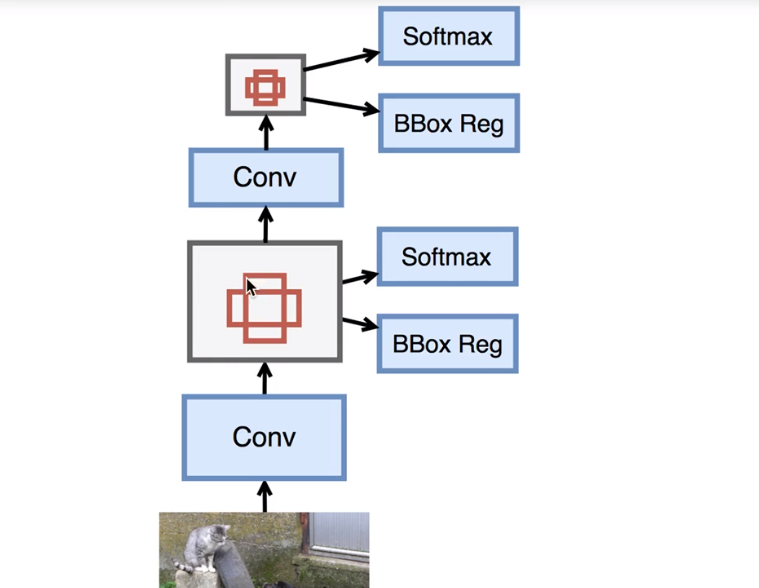

R-CNN系列的框架，框的选择和框的分类是分开来做的。
==SSD：单发多框检测器，将box的选择和分类做成了一个，即对每个框都计算它属于某个类别的概率，和四个位置的偏移量。==
与R-CNN的不同
- 只有一次softmax，就是直接对锚框进行分类，直接做BBox Reg。
- 为了提高准确率，然后改变卷积的之后的scale，继续进行选择锚框，然后对锚框直接进行分类，和对锚框进行BBox reg。
- 两次的BBox，都会输出，相当于有多个输出。
==结合了YOLO中的回归思想和FasterR-CNN中的Anchor机制，使用全图各个位置的多尺度区域特征进行回归，即保持了YOLO的速度快特性，也保证了窗口预测的速度。==
## 单发多框检测器原理
与faster R-CNN的区别
- 也是以feature map以某些像素为中心生成锚框；但是与faster R-CNN的区别就是默认框不是n*m个而是n+m-1个（n个放缩系数，m个比例系数）。
- 不做二分类和N分类，直接对锚框做N+1分类，然后进行一次anchor的回归。

利用金字塔的思想，然后多feature map做下采样。

上图中的第二个conv是一个减半模块，即定义一个卷积块，它将输入特征的长宽减半，以此来获取多尺度的预测。它由两个conv-batch-relu组成，我们使用填充为1的3*3卷积使得输入和输出有同样的长宽，然后再通过跨度为2 的最大池化层将长宽减半。
#### 一个最简单的模型
四块
- 主体网络
- 三个减半模块
- 物体分类和边框预测模块。
## SSD默认框的回归和分类
生成默认的边界框
- 中心点：对于每个piex，我们都作为中心点生成一次。
- 确定中心点之后，确定边框有多大，给定size，边界框的就是ws*hs
- 给定比例，长宽比，生成的边界框形状是w*sqrt(r)\*h/sqrt(r)
- 所以给定n个大小和m个比例。为了计算不生成nm个锚框，而是==n+m-1==个，其中第i个锚框使用：
    - size[i]和ratios[0],如果i<=n；
    - size[0]和ratios[i-n]，如果i>n；
#### 预测物体的类别
==以边框的顺序为基准来进行计算==
假设有m个边框，n个class，输出通道数channel是==num_BBox*（num_class+1）==，每个通道对应一个边框对某个类的置信度。
假设输出是Y，那么对应输入第n个样本的第（i，j）像素的置信值是在Y[n,:,i,j]里，具体来说，对于以（i，j）为中心的第a个锚框：
- 第a*(n+1)通道是其只包含背景的分数。
- 第a*（n+1)+1+b通道是包含第b个物体的分数。
####  预测边界框（框的回归）
==以边框的顺序为基准来进行计算==
就是预测出边界框的delta是多少。
因为真实边界框可以是任意形状，我们需要预测如何从一个锚框变换成真正的边界框。这个变换可以是由长为4的向量来描述。同上我们有一个==num_anchors*4==通道的卷积。

假设输出是Y，那么对应输入中第n个样本第（i，j）像素为中心的锚框的转换在Y[n,:,i,j]。具体来说，对于第a个锚框，它的变换在a*4到a*4+3通道里。
- 即第n样本的第ij个像素的所有的bbox的delta的值都在Y[n,:,i,j]里，所以是一个映射关系。
## 下采样-减半
一次形状不变的卷积，加上步长为2的maxpooling卷积。
## 预测的输出
是一个num_bbox*6的向量，即每一个锚框有6个参考标准：box的位置，类别的id，得分的大小。
## 数据集
label+boundingbox
