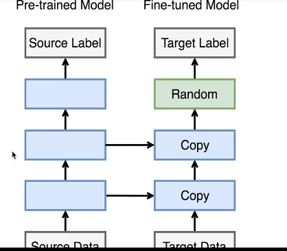

- 很快的收敛模型
- 要求的数据集没有那么大
## 通过微调（fine-tuning）来迁移学习
ImageNet是默认的数据集，超过一百万张图片和一千类物体。
我们可以使用这个训练好的模型，来改进自己的神经网络架构。
## 为什么fine-tuning可以有效？
因为网络的前几层提取的都是颜色信息，纹理信息等，所以基本上前几层对于大多数的视觉任务都是相同的，而分类任务或者说更高层的语义信息层可能都推迟到后几层，所以我们可以在训练模型时候，可以拿一个比较好的模型，然后砍掉最后几层，保留前几层，然后用自己的数据集训练后几层即可。

不但下载模型，而且把权重也下载下来。
与训练好的模型通常有两块构成，一是features，二是classifier。后者主要包括最后一层全连接层，前者包含从输入开始的大部分层。这样的划分主要是为了方便微调。
## 怎么做fine-tuning？
创建一个新的模型
`from mxnet import init`
`fintune_net = models.resnet18_v2(classes = 2)`
然后将下载下来的模型的权重赋值给新建的模型
`finetune-net.features = pretrained_net.features`
`finetune-net.classifer.initialize(init.Xavier())`
