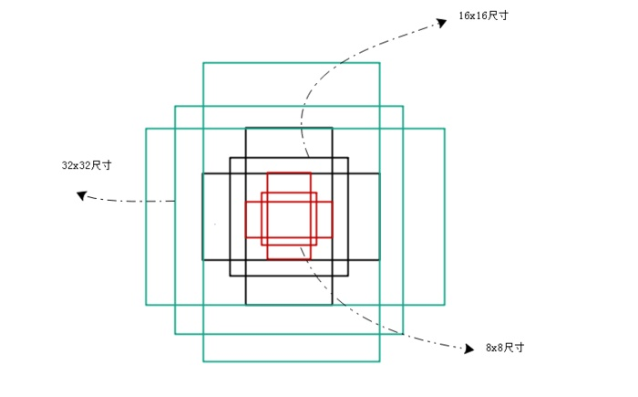
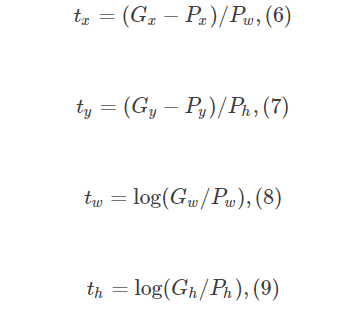
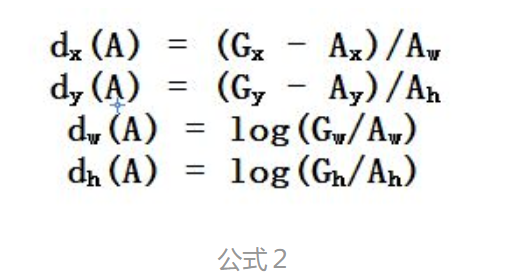

真实边框的输入：
$$（t_x,t_y,t_w,t_h)$$
## 边框学习学习什么？
先做平移，再做尺度缩放。
就是学习平移量和尺度缩放量。
## 特征提取
就是得到feature map也就是得到feature map之前所作的卷积+pooling，这部分和普通的CNN网络没什么区别，可以使用VGG，ResNet，Inception等实现
## RPN部分
#### RPN分类
就是一个而分类的过程，先要在feature map上均匀划分出K*W*H个区域称为anchor（K一般取9，WH为feature map的宽和高），比较anchor和grounding truth的重叠情况来决定哪些anchor是前景，哪些是背景，也就是给每一个anchor打上标签。
K取9一般就是三种尺寸，再组合三种长宽比（1,2,0.5）。如下图所示

#### RPNbounding box回归
RPN classification给所有的anchor打上label之后，我们需要一个表达式建立anchor与ground truth的关系，假设anchor的中心坐标为【Ax，Ay】，长宽为Aw和Ah，对应的ground truth为【Gx，Gy，Gw，Gh】，它们之间的关系可以使用下面公式表示：

然后可以由上述公式推导出下述公式：

需要进行的平移变换和尺度缩放，或者说Dx，Dy，Sw，Sh。P经过这四个值得到的不是真实的G，而是预测值G_hat。真实的平移量和尺度所放量是由下面的公式计算出来：
## Proposal Layer部分
得到proposal大致位置后的下一步就是要做准确位置的回归了，在RPN的训练收敛后我们能得到anchor相对于proposal的偏移量，由于有9*W*H个proposal，我们没有必要对所有的区域计算，这时就要使用一些方法来精选出最接近ground truth的proposal，Ross Girshick给出了三个步骤：
- 先选出前景概率最高的N个proposal
- 做非极大值抑制
- NMS之后再选出前景率最高的M个proposal

经历上述三个步骤，位置还不够精确，需要利用上述公式再反推出大致的proposal和真实的ground truth还有多少偏移量。对于这个新的偏移量再来一次回归完成精确的定位。
## ROI Pooling部分
在得到的proposal，然后将其应用到feature map中，抠出区域，然后使用分类网络进行物体分类识别。
## 为什么宽高尺度设计以下形式？
保证旋转不变性所以要除以Pw，Ph相当于做一个归一化处理，使得具有尺度不变性。

要保证尺度放缩系数（Gw/Pw）大于零，所以做一个exp函数的转换，反向计算就变为log函数。
