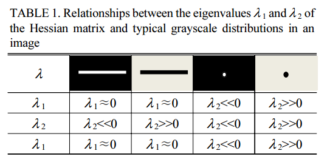

分为两种类型
# 单像素级别
- 极值法：寻找列方向的最大值。
- 阈值法：寻找焊缝的边缘，取中心点作为焊缝中心点（需要二值化，来做提前处理）。
- 模板法：通过在4个方向上做卷积，然后对比取最大的那一点为焊缝的中心点。
# 亚像素级别
### 灰度重心法
### 曲线拟合法
先拟合出激光线的形状，然后通过拟合出额曲线来求取极值，进而求取中心线的亚像素坐标。
### Steger的Hessian-matrix方法

首先由激光线的特征值找到激光线的法线方向（主要是找方向，是不是二值图像无所谓），然后根据法线方向上的泰勒展开，来获取中心线亚像素的位置。

通过px,py(tnx,tny)的值小于0.5,来判定一个点是不是在一条直线上，然后如果满足的话证明这个点在一条直线上。

先将点在（x0+tnx，y0+tny）方向上泰勒展开，在（x0，y0）附近对离散点进行拟合，对t进行一阶导数，然后为零时来求得t值，代入t即可得到拟合的最大值，

然后使用二阶高斯导数卷积的作用就是图像先进行高斯滤波，然后在进行二阶导数的计算。
