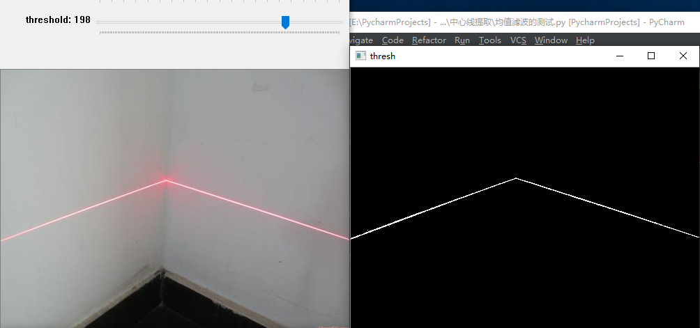
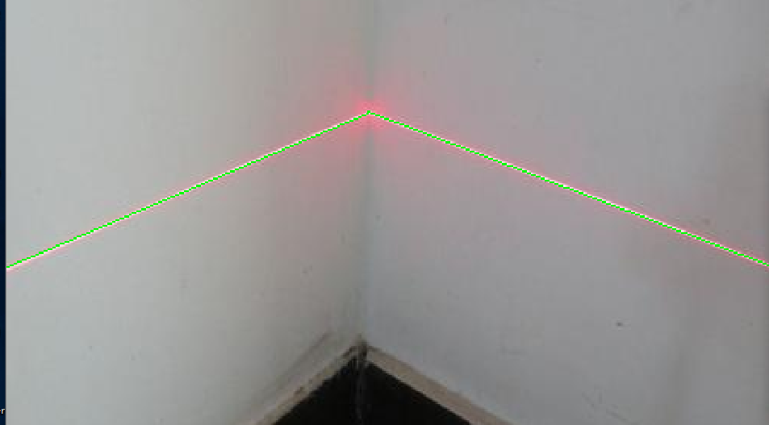
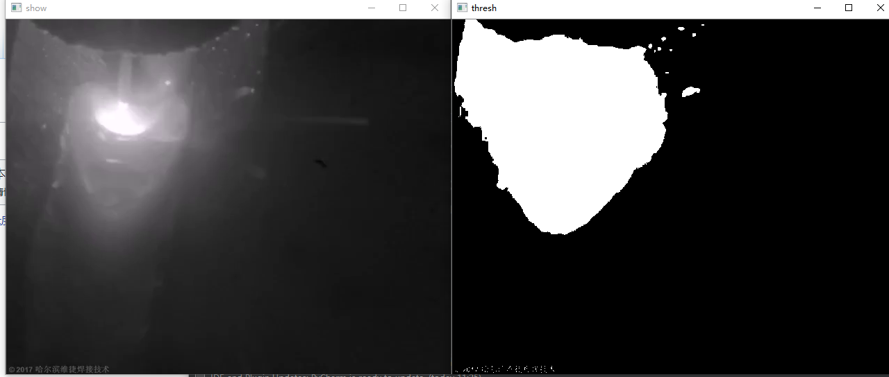
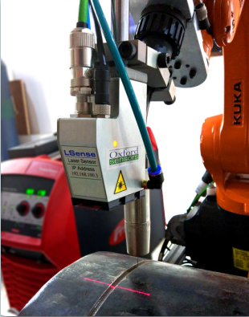

使用结构光来提取焊缝的中心线的位置，进而实时调整焊接末端的位置，达到焊缝跟踪的目的
## 视觉系统的标定
需要搭建一个视觉系统，系统由线激光器，相机，机器人组成。
在搭建完成视觉系统后，需要进行
- 相机参数的标定
- 相机坐标系与焊接末端的位置关系标定
- 相机坐标系与激光平面位置的标定
## 图像的处理
对相机捕捉的图像进行处理
- 图像预处理，滤波，图像增强
- 提取激光条纹
- 提取激光条纹的中心线
- 提取焊接特征点
- 将提取出的特征点经过标定好的视觉系统，计算出焊接特征点在机器人坐标系中的位置
## 焊缝纠偏
由上一步提取出来的焊接特征点的位置信息
- 计算机焊接末端的位姿
- 相应的控制算法控制末端的运动

 ----  

## 中心线的提取

 ---
## 熔池图像

## 视觉系统
哈尔滨维捷焊接技术有限责任公司

