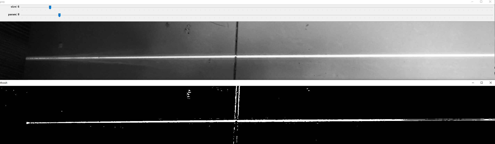
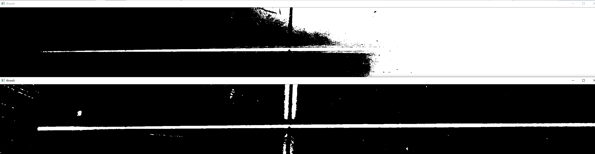
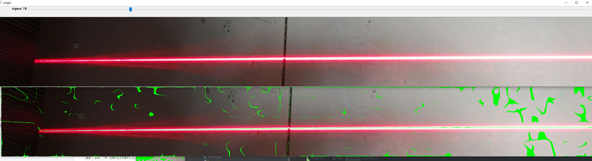
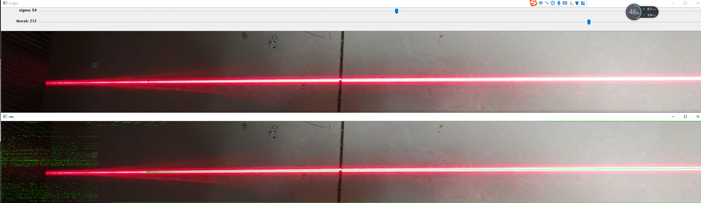
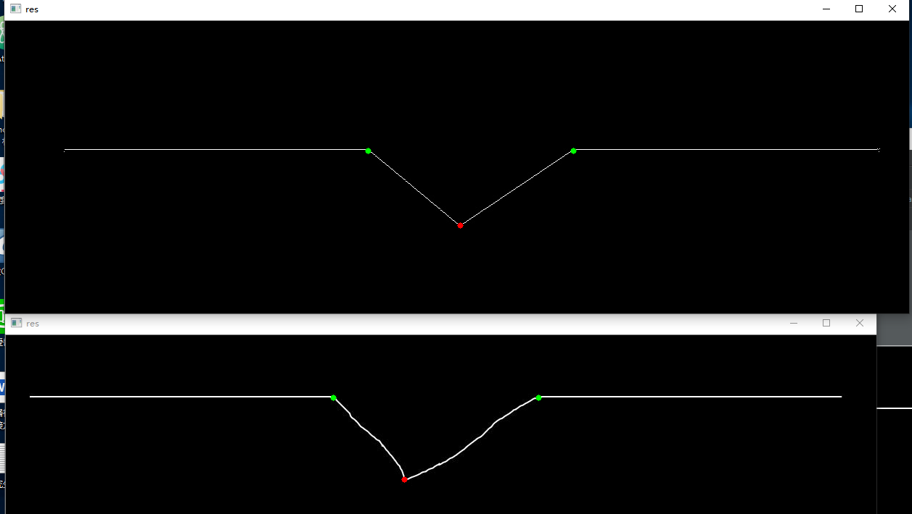

## 自适应阈值分割实验
- 全局阈值分割实验

- 自适应阈值分割
可以先分别进行自适应阈值分割与全局阈值分割，然后根据对应点之间的关系来处于自适应得到的结果

## Steger算法
迭代法进行骨架提取实验，适合的条纹类型广泛，速度相对较慢。
- 没有优化的steger算法

- 优化之后的steger算法：使用自适应分割阈值法来提取ROI区域，之后的处理只在ROI区域进行，处理完成之后，将得到的结果与ROI的二值化图像做位与操作；使用高斯核的一阶二阶微分来卷积处理，提高运算速度。

## Zheng-sune算法
对条纹形状没有要求，可以是曲线或者直线型，抗噪性好，精度相对较高
但是由于是迭代算法，速度比较慢
## 灰度重心法
适用于直线型焊缝，速度快，抗噪性差。
## 本文骨架提取+灰度中心法结合
## 模板匹配特征点提取
模板配匹配（V性坡口的梯度角度范围是：33.690067525979785~71.56505117707799）+极值法+亚像素坐标提取
速度快，精度高

