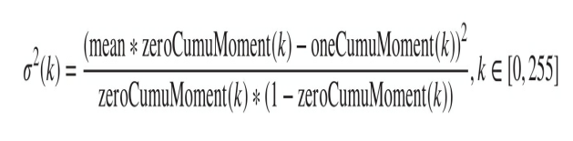

## 视觉系统的标定
## 图像预处理算法
#### 二值化的方法选择
1. 中值滤波：滤除大多的噪声。
2. 模板匹配寻找ROI区域。
3. 图像分割：OSTU最大类间方差分割的方法，3*3和5*5和7*7。
所选取的分割阈值应使前景区域的平均灰度，背景区域的平均灰度与整幅图像的平均灰度之间的差异最大，这种差异用区域的方差来表示。
算法的步骤：
     - 计算灰度直方图的零阶累积矩：zeroCumuMoment(k)
     - 计算灰度直方图的一阶累积矩: oneCumuMoment(k)
     - 计算图像的总体平均灰度mean:oneCumuMoment(255)
     - 计算每一个灰度级最为阈值时，前景区域的平均灰度，背景区域的平均灰度与整幅图像的平均灰度的方差。
     - 找到上述最大的方差对应的阈值即可。
     - 
#### 重心极值法
1. 中值滤波
2. 模板匹配寻找ROI
3. 然后重心极值求取每列的最大像素值的坐标
## 激光焊缝中心线和特征的提取
#### 二值化方向
- 细化操作
- 检测直线，求取直线
- 细化操作就是把二值化处理后的图像区域处理成单像素的中心线，降低图像的信息总量，提升后期的图像数据运算的速率。
#### 极值化方向
散点最小二乘拟合，然后拟合出交点和拐点。
