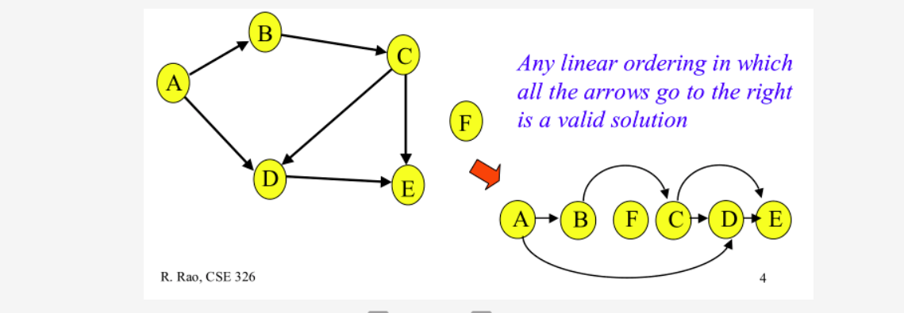

## DAG（有向无环路图）
对于依赖关系，我们通常很容易将其表示为一个有向非环路图（DAG），并将其寻找依赖顺序过程（寻找所有沿着特定顺序前进的边与点）称为拓扑排序。

通常情况下，继承关系会形成一个DAG。为了让人能找出相关方法的出处，大多数编程语言都会致力于创建一种线形化的类关系，其实这就是DAG的拓扑排序算法。
Python最新版本中所使用的方法解析顺序（method resolution order，MRO）叫做C3
